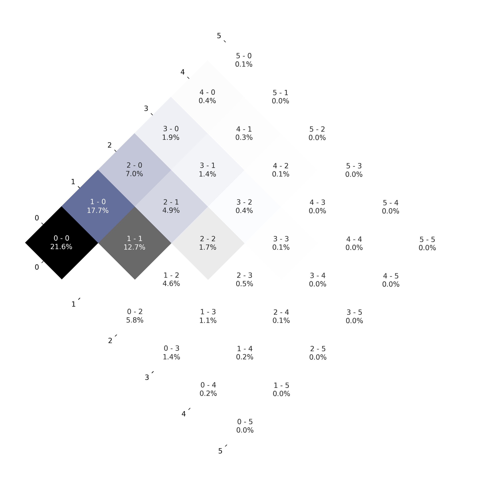
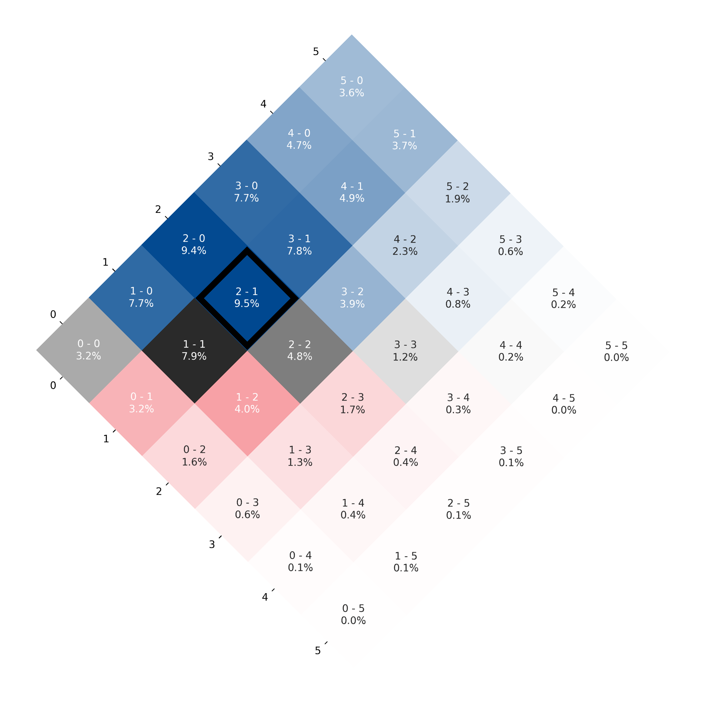
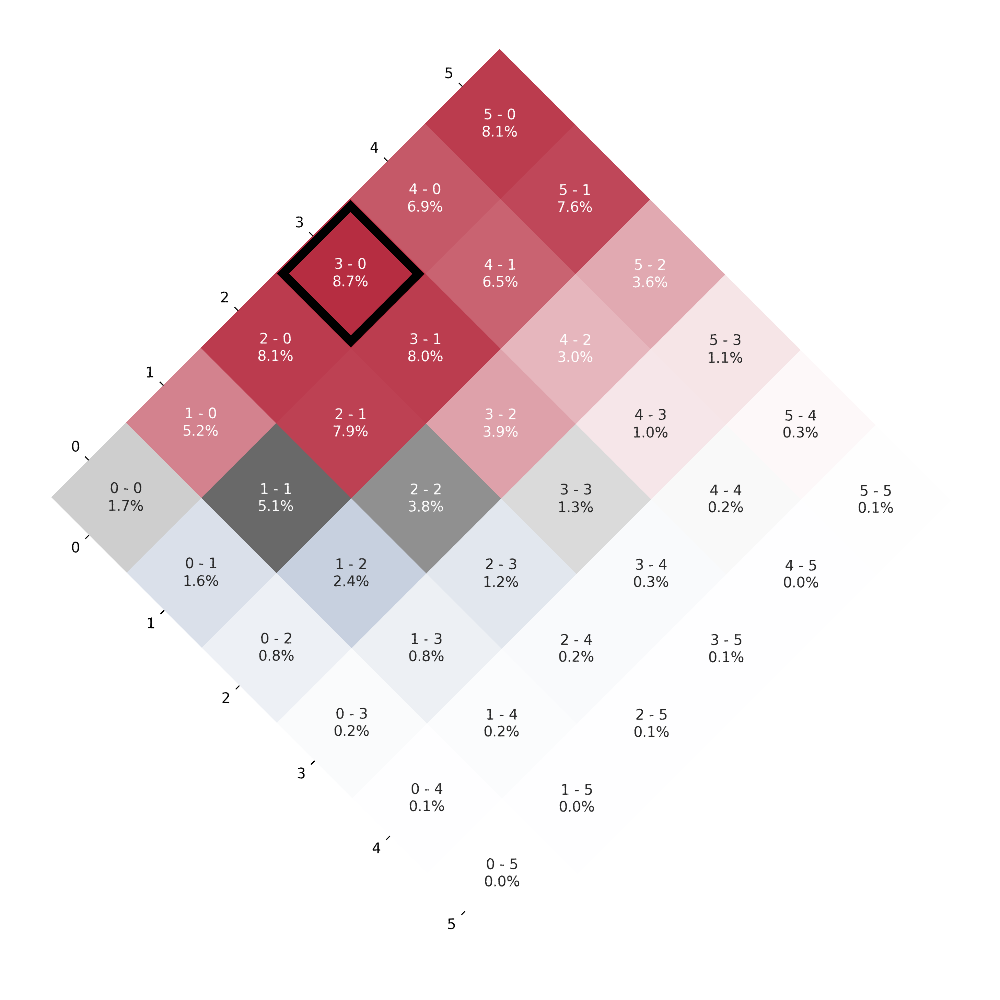

# Match Outcome Simulation

This project simulates the possible outcomes of a football match using a Poisson-based model. By leveraging expected goals (xG) data, the simulation generates probabilities for different scorelines and visualizes them through a heatmap. The project also includes image processing to enhance the presentation of the results.

## Features

- Extracts match data from a CSV file.
- Uses a Poisson distribution to simulate match results.
- Generates a probability matrix for different scorelines.
- Visualizes the results with a color-coded heatmap.
- Highlights the most probable outcome.
- Saves and processes the heatmap image.

## Technologies Used

- **Python**
- **NumPy**
- **Pandas**
- **Seaborn**
- **Matplotlib**
- **Pillow (PIL)**
- **OS**

## How It Works

1. **Simulation Function (`simulation(url)`):**
   - Extracts `match_id` from the provided URL.
   - Reads the corresponding CSV file containing team data.
   - Simulates 100,000 match results based on expected goals (xG) using a Poisson distribution.
   - Creates a probability matrix for possible scorelines (limited to a maximum of 5 goals per team).
   - Visualizes the probability matrix using a heatmap.
   - Highlights the most probable outcome with a rectangle.
   - Saves the generated image with adjusted cropping and rotation.
   - Returns the probability of home win, draw, away win, and expected points for each team.

2. **Image Import Function (`import_img(url, ax=None)`):**
   - Extracts `match_id` from the provided URL.
   - Finds and loads the saved heatmap image.
   - Displays the image either in a new figure or within a specified subplot.

## Example Output

- **Home team win probability**: 45.2%
- **Away team win probability**: 30.5%
- **Draw probability**: 24.3%

Additionally, a heatmap is generated where the most probable scoreline is highlighted.

## Example Heatmaps

Here are some example heatmaps generated by the simulation:

1. **Copa de la Liga Profesional 2024 Round 12 - Talleres 1 v 0 Velez Sarsfield**

   

2. **Copa de la Liga Profesional 2024 Round 12 - Boca Juniors 2 v 1 San Lorenzo**

   

3. **Copa de la Liga Profesional 2024 Round 11 - Argentinos Juniors 3 v 0 Rosario Central**

   

## Potential Improvements

- Integrate real-time match data.
- Enhance visualization aesthetics.
- Optimize performance for large datasets.
- Allow user-defined simulation parameters.
